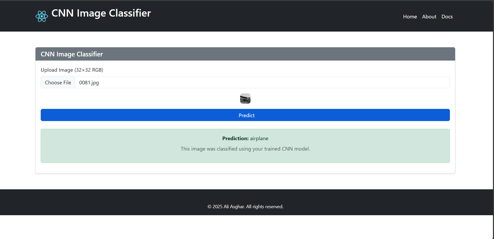

# CNN Image Classifier Dashboard

A full-stack machine learning dashboard that classifies images using a trained Convolutional Neural Network (CNN). Built with React, FastAPI, and PyTorch, this application demonstrates real-time image prediction, modular backend architecture, and PostgreSQL integration for persistent logging.

## Features

- Upload and classify images using a trained CNN (CIFAR-10)
- FastAPI backend with modular `model/` and `utils/` structure
- React frontend with clean UI and prediction output
- PostgreSQL integration to store predictions and timestamps
- MIT Licensed for open use and contribution

## Tech Stack

| Layer      | Tools Used              |
|------------|-------------------------|
| Frontend   | React, Axios, Bootstrap |
| Backend    | FastAPI, Python, PyTorch|
| ML Model   | CNN trained on CIFAR-10 |
| Database   | PostgreSQL (via SQLAlchemy) |
| Deployment | GitHub (local setup)    |

## Folder Structure

cnn-image-classifier-dashboard/ ├── frontend/ │   
                                       └── React components (MainAppForm, About, Docs) 
                                ├── backend/ │   ├── main.py │   
                                       ├── model/ │   
                                       │   └── cnn_model.py │   
                                       ├── utils/ │   │   └── predict.py │   └── db/ │       ├── database.py │       └── models.py 
                                ├── docs/ │  
                                       └── demo.png 
                                ├── .gitignore ├── README.md


## How to Run Locally

1. Clone the repository:
        git clone Here’s your complete, professional README.md content — ready to copy and paste directly into your GitHub repo:


## How to Run Locally

1. Clone the repository:


git clone https://github.com/datadreamsbyasghar/cnn-image-classifier-dashboard.git

2. Set up the backend:
- Create and activate a virtual environment (optional)
- Install dependencies:
  ```
  pip install -r requirements.txt
  ```
- Ensure PostgreSQL is running and update your database URL in `database.py`
- Run the FastAPI server:
  ```
  uvicorn main:app --reload
  ```

3. Set up the frontend:


cd frontend npm install npm start

## PostgreSQL Integration (Week 7)

- A `Prediction` table is created using SQLAlchemy
- Each prediction is logged with:
- Image filename
- Predicted label
- Timestamp
- Future enhancements may include a frontend dashboard to view prediction history

## Demo Screenshot



## License

This project is licensed under the MIT License. See the LICENSE file for details.

